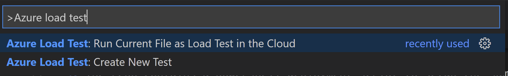
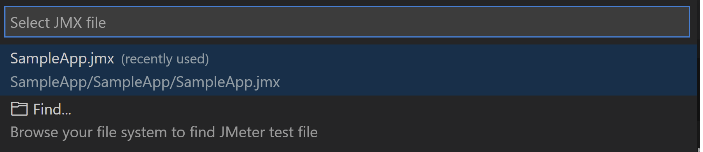
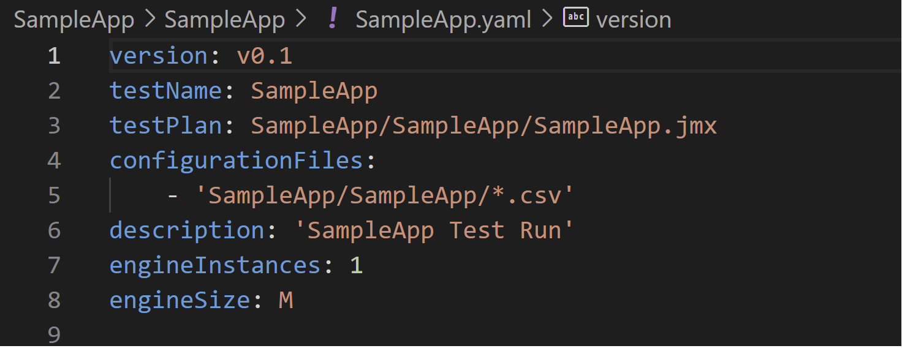
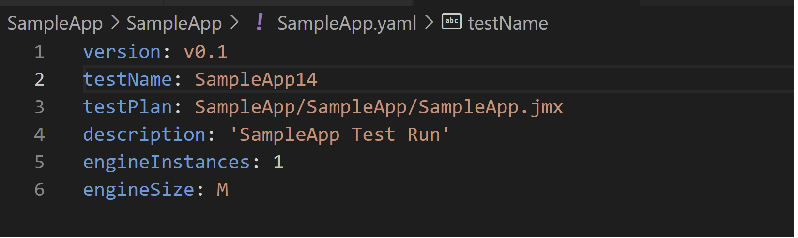
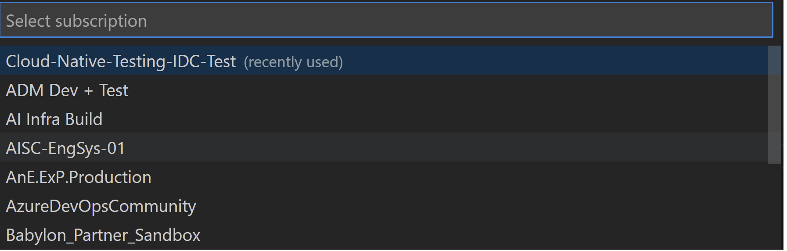
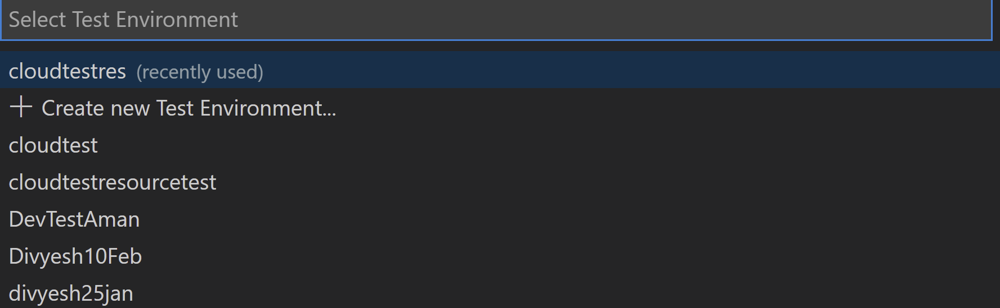
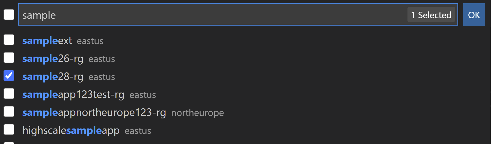
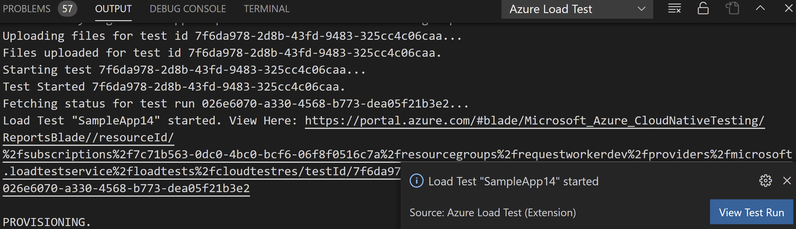

# Outline
### Introduction
### Pre-Requisites
### Running your first load test
### Results dashboard on Azure Portal
### Cleanup resources
### Known issues

# **Introduction**

Do you feel that you constantly struggle to assess your applications when they run at scale? And is it too cumbersome to go through multiple runs and still unable to figure out what is going wrong with the apps. Cloud Native load testing service is azure’s fully managed PAAS (Platform as a Service) that lets you deploy and scale web and API load and performance tests. It offers the flexibility to author a load test using the unique Yaml runbook combined with the robust AKS rig to run the test and a single pane to view the most important metrics are some salient features that the service provides. The current setup utilizes our load testing VS code extension which allows the user to configure the load test runbook on Vs Code.  
With this tutorial you would learn how to:  
:heavy_check_mark: Setup the sample app.  
:heavy_check_mark: Run your first load test.  
:heavy_check_mark: Identify bottlenecks associated with a sample application by looking at server-side metrics.  
:heavy_check_mark:	Reconfigure and Re-run the load test to identify improvements in app performance.  
:heavy_check_mark:	Clean up resources.

In case you have any issues . Please reach out on [Cloud native test](mailto:cloud_eng@microsoft.com)

# **Pre-Requisites**

### **Feature Registration Request**
1. Open a command window, log into your Azure account, and set the current active subscription to the subscription you wish to use for load tests:

        
        az login
        az accountset --subscription <your-subscription-id>

        

2. Run this command to get tenant id:
        
        az account show

3. To get the subscription and the users allowlisted, send an email to azloadpreview@microsoft.com with details including tenant id, subscription id and user email id(s) authorized to use this service.
4. Parallel to step 3, run the following command for resource provider registration:
        
        az provider register --namespace Microsoft.LoadTestService

5. Monitor registration status with the following command:
        
        az provider show --namespace Microsoft.LoadTestService

   Status will eventually show as "Registered" once registration has completed.

6. Wait for a response to email sent in Step 3 to start using the service.
  
### **Azure Load Test Extension installation on VS code**

1. Download the [Azure Load Test Extension](https://github.com/microsoft/azureloadtest/tree/main/vsix) ".vsix" file for Visual Studio Code.

2. Bring up the Extensions view by clicking on the Extensions icon in the Activity Bar on the side of VS Code or the View: Extensions command (Ctrl+Shift+X).

3. Use the action Install from VSIX under the more actions menu (...) to install the extension.

4. Once complete, restart VS Code. You'll see an Azure Load Test icon in the Activity Bar under the Extensions view.

5. The tutorial requires azure cli and git to be installed in the system for installing the sample application. You may use [azure cli installation](https://docs.microsoft.com/en-us/cli/azure/install-azure-cli) to install azure cli and [git installation](https://git-scm.com/downloads) for installing git on your machine.   

# **Setup the sample app**

1. The sample application used in this tutorial is a node.js counter app consisting of an app service web component and a cosmos db backend.Use git to clone the sample application to your machine.

        git clone https://github.com/issacnitin/SampleApp.git

2. Change into the cloned directory

        cd SampleApp

3. The repo contains a powershell deployment script to setup the sample app, a sample JMeter test script to be run and other dependencies.
4. Deploy the sample app.

        .\deploymentscript.ps1

5. You would be prompted for a unique name for the sample app and a location for the same. In case no value is provided for the location the default location would be eastus.
# **Run you first load test**

Now that we have setup the environment and installed the Azure load Test Extension, let’s get started with running your first load test.

1. Use **Ctrl+Shift+P** to launch the command palette. Type in keyword “Azure load “ as shown below to find the two commands associated to the azure load test extension.  
    * Create New Test - This command is used to author a new test from scratch.   
    * Run Current File as Load Test in Cloud – This command is used to run an existing Yaml runbook at scale in cloud.   

    

2. Select the command **Create New Test**

3. Select a test plan **SampleApp.jmx**. if there are multiple jmx at the workspace, they will be shown as a list. There is also a browse option to search for a test plan within your local file system.	
    
    
4. A YAML runbook with smart defaults will open. By default, the name of the YAML runbook would be the name of the test plan that we selected in the previous step. This runbook will be created and saved in the current workspace.

    

5. You can edit the parameters or comment the optional parameters if those don’t apply. For instance, since we don’t have any configuration files associated with our current test plan, hence we are going to remove it for now. The resulting Yaml will look something as below.

    

6. Use Ctrl+Shift+P to launch the command palette and select the command Run Current File as Load Test in Cloud. When you select the command, you would be prompted to Sign in to Azure if you have not already signed, else you would be shown a list of subscriptions applicable to you as below.

    

7. Select the subscription against which you would like to run your load test. Once you have selected the subscription, you would be asked to select a Cloud test environment.

    

8. Select the Resource group(s) that contain app components for which you would want to see the server side metrics.

    

Once we have selected the resource group(s) and hit ok. The validations will be performed and If everything is okay, then the test will be launched with status messages as shown below. You may click on the View here Link to go to the portal and see the metrics related to your load test.  

   

Once the load test completes you will be presented with a URL to view the detailed results on the Azure portal as shown below.  

   

# **Identify bottlenecks associated with a sample application by looking at the lcient side and server-side metrics.**

Now that we have run the load test and we have the detailed report available at the link as described in the previous section. Let’s go and analyze the test results and see if there is a bottleneck by examining the server side and client-side metrics.
On the summary page, we see that the response time has increased along with the errors.
     
To Understand why this has happened click on the detailed report tab which will open a view listing app component as below grouped by the component type	
Our Sample app had two components viz. cosmos Db which can be found under the database tab and Webapp hosted on app Service which can be found under the web application tab.Under the App service plan we see that the CPU usage (CPU percentages and the memory percentages) are well within limit and don’t show any bottlenecks caused by overuse or higher memory consumption.  
    
The above step gives us an idea that the increase in number errors as well as the response time might be due to the other app component ie. Cosmos DB. Let us examine it to make sure that is the case. When we open the database tab and expand the metrics pane related to the Cosmos Db, we see that the Ru has been consumed and that might be causing the throttling of by cosmos db.
    
Now that we have identified the bottleneck which is caused by the low RU setting on the free tier as we had selected for the cosmos DB. Let us now go ahead and update the RU manually and see if the bottleneck has been addressed.

# **Reconfigure and Re-run the load test to identify improvements in app performance.**

For configuring the RU settings manually please visit the Cosmos DB blade of the resource we had deployed.  

    
</p?=>
Click on the Scale and settings option and set the value to 800 RU and click on save present on the top of the blade. You will be able to see the associated cost too.

    

Going back to the test run page by clicking on the Test resource ->Test -> Test name. You will see the list of the test runs. On the top of the page click on the run tab you will get info that the test would be run with the jmx file that was uploaded and the latest configuration of the app component. Click on the run button to run the test again.

    

You would see an entry for the new test run with the status column changing to configuring, executing. you can click on the test run and you would be taken to the metrics summary page of the test run.
Once the load test has finished let us again go and see the client-side metrics (response time and errors graphs) and the server side metrics for cosmos db and see if the performance has improved.

    

	 
    

We see that the response time has improved compared to the last test run and also the normalized Ru consumption has been well under the limits and hence we can conclude that the server is able to service the requests and is not constrained now.

# ** Clean Uup resources**

Now that we have successfully run our first load test and have been able to identify and correct bottleneck in our application, you may want to delete the resources so that you don’t incur charges. Use the az group delete command to remove the resource group, and all related resources.

	az group delete –name resourcegrouname
       
You can also utilize the delete function on the concerned resource group’s blade in order to remove the resources as shown below.

